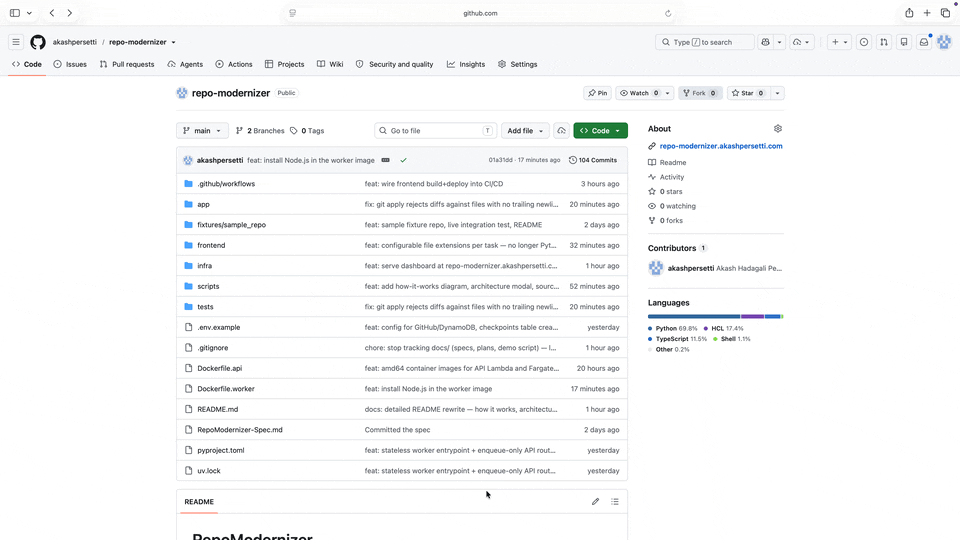

# RepoModernizer

Autonomous repository modernization agent. Give it a GitHub repo and a goal (e.g. "Flask → FastAPI"),
and it plans a file-by-file migration, rewrites each file with an LLM, runs the target repo's own
test suite after every change, pauses for human approval on risky diffs, survives crashes
mid-migration, fails over across model providers, enforces a hard cost cap, and opens a real pull
request — end to end, deployed on AWS.


<!-- Uncomment the line above once docs/demo.gif is recorded (see docs/demo_script.md locally). -->

**Live dashboard:** https://repo-modernizer.akashpersetti.com
**Live API:** https://6yncgq73gk.execute-api.us-east-1.amazonaws.com

## What this proves

| Scarce signal | How this project proves it |
|---|---|
| Autonomous execution (not chat) | The agent runs an unattended multi-step migration to completion, no human in the loop except approving risky diffs |
| Durability / crash-recovery | LangGraph checkpointer → DynamoDB, one item per step. A fresh Fargate task (no shared memory with whatever ran before it) resumes from the last committed step. Proven two ways: an automated test that kills a run mid-migration and asserts a brand-new process picks up where it left off (`tests/test_crash_recovery.py`), and this is literally how `start`/`approve`/`resume` work in production — each is a separate one-shot container |
| Human-in-the-loop | `interrupt()` pauses the graph before applying any diff whose heuristic risk score clears a threshold; approve/reject via the dashboard or the raw API. The pending diff is shown verbatim before you decide |
| Fault tolerance | Bounded retries with exponential backoff on transient failures (guardrail rejection, failing tests, a bad diff `git apply` can't parse), then Bedrock model failover (primary → fallback) if the provider itself is erroring. Both paths are unit-tested with simulated failures; the retry path has been exercised live, the provider-failover path has not (a live Bedrock outage isn't something you can trigger on demand) |
| Cost governance | Per-task token→dollar budget tracked across every LLM call; a hard stop before the next file starts if it would exceed the cap. Visible in every response (`cost_used_usd`) |
| Guardrails | Diffs are validated before ever touching disk: no file deletions, no writes outside the target file, a forbidden-path list (`.github/`, `migrations/`, `*.lock`), a max-changed-lines cap |
| Production deploy | API Gateway (HTTP API) + Lambda (FastAPI via Mangum, container image) → SQS → a second Lambda that triggers a one-shot Fargate task per message → DynamoDB for state, EFS for the git workspace. Terraform-managed, deployed via GitHub Actions using OIDC — no long-lived AWS access keys anywhere, including in CI |
| Zero standing cost | No NAT Gateway, no ALB, no EC2, no `aws_ecs_service` with a running task count — every compute path scales to zero when idle. AWS Budgets tripwires at $5/$10 as a backstop |

## How it works

The core is a LangGraph state machine (`app/agent/graph.py`), checkpointed after every node:

1. **`ingest`** — clone the target repo into a workspace, seed state.
2. **`plan`** — one LLM call reads the file tree and returns an ordered migration plan: which files, why, and a 0-1 risk score for each.
3. **`migrate_file`** (loop, one file per pass) — read the file, ask the LLM for the *complete new content* (not a hand-written diff — a diff computed with `difflib` against the real on-disk source is what actually gets applied, since asking an LLM to hand-produce a byte-exact unified diff is fragile in practice), validate it against guardrails, `interrupt()` for approval if risk clears the threshold, apply, run the repo's own test command, retry with the failure fed back into the next attempt if it fails, or fail the file after a bounded number of retries and move on.
4. **`finalize`** — commit whatever was migrated, push a branch, open a PR with a summary.

Everything above the state machine is about making it durable and operable: a custom
`DynamoDBCheckpointer` (checkpoints, per-step, matching a hand-designed `PK`/`SK` schema) so the
graph can be resumed by a process that has never seen it before; guardrails and a risk heuristic
that gate every diff before it touches disk; a `BudgetTracker` that hard-stops a task before it
overspends; a `ProviderRouter` that retries the primary Bedrock model with backoff before failing
over to a secondary model.

## Architecture

```
Browser (S3 + CloudFront, static Next.js export, CloudFront Function for SPA-style routing)
   │ client-side fetch, CORS
   ▼
API Gateway (HTTP API) → Lambda (FastAPI + Mangum, container image)
   │  POST /tasks         validate, enqueue to SQS, return task_id immediately
   │  GET  /tasks/{id}     read-only: graph.get_state() against DynamoDB, no LLM/GitHub calls
   │  POST /tasks/{id}/approve, /resume    validate, enqueue
   ▼
SQS (repomod-tasks)
   │
Lambda consumer (SQS-triggered) → ecs:RunTask, one Fargate task per message
   │
Fargate worker (one-shot, no standing service, EFS-mounted /mnt/workspace)
   clone (start only) → graph.invoke(...) → commit/push/open PR if the graph reached the end
   │
DynamoDB (repomod-checkpoints) — every step, survives across separate task invocations
```

Why this shape, briefly:

- **Lambda for the API, Fargate for the worker.** Lambda's 15-minute ceiling can't hold a
  multi-file migration; the API stays serverless (cheap, scales to zero) while the actual graph
  runs on a Fargate task pulled from a queue.
- **One-shot Fargate tasks, not a long-running service.** `start`, `approve`, and `resume` are each
  a fresh container — no `aws_ecs_service`, no standing `desired_count`. This is also why the git
  workspace needs to live on EFS rather than the container's own ephemeral disk: a later `approve`
  runs in a container that has never seen the one that ran `start`.
- **Real checkpointing, not just state.** The point of a custom `DynamoDBCheckpointer` implementing
  LangGraph's `BaseCheckpointSaver` (rather than, say, a bespoke status table) is that `graph.invoke()`
  itself resumes correctly from any point — including from an `interrupt()` — with zero special-casing
  in the app code for "was this a crash or a deliberate pause."

## Repo structure

```
app/
├── agent/            # the LangGraph state machine: graph.py, nodes.py, state.py,
│                      # guardrails.py, risk.py, budget.py, providers.py, checkpointer.py
├── api/               # FastAPI routes (routes_tasks.py, routes_health.py)
├── services/          # diffs.py (parse/apply/generate), github.py (clone/branch/PR), tests_runner.py
├── worker/            # entrypoint.py (Fargate's one-shot driver), consumer_handler.py (SQS→ECS Lambda)
├── cli.py             # local CLI entry point (no AWS infra needed beyond Bedrock)
├── config.py          # pydantic-settings
├── main.py             # FastAPI app (local/dev use)
└── lambda_handler.py   # Mangum ASGI adapter for the API Lambda
frontend/
└── app/               # Next.js App Router, static export: / (start form), /task (status + approve)
infra/                 # Terraform: vpc, efs, dynamodb, sqs, ecr, lambda, fargate, apigateway,
│                       # frontend (S3+CloudFront), iam, github_oidc, budgets
tests/                 # 17 test files, unit + a few real-AWS/real-GitHub integration tests
fixtures/sample_repo/  # tiny Flask app used as a migration target for local/CI runs
scripts/               # one-off bootstrap scripts (Terraform backend, DynamoDB table)
```

## Run it yourself

The live dashboard above is the easiest way — submit a repo URL and goal, approve the risky diff
when it pauses, watch the PR appear.

To run locally instead, the CLI needs only Bedrock access (no other AWS infra):

```bash
uv sync
cp .env.example .env   # fill in AWS credentials with Bedrock access
uv run repomod run --repo ./fixtures/sample_repo --goal "Flask to FastAPI async" --test-cmd "pytest -q"
```

Or run the full local service (a real FastAPI + DynamoDB checkpointer, no Lambda/Fargate/SQS):

```bash
DDB_TABLE_CHECKPOINTS=repomod-checkpoints ./scripts/create_checkpoints_table.sh   # once
uv run uvicorn app.main:app --reload
```

```bash
curl -s -X POST localhost:8000/tasks -H 'content-type: application/json' \
  -d '{"repo_url":"https://github.com/<you>/repomodernizer-demo-target","goal":"Flask to FastAPI async","test_command":"pytest -q"}' | jq

curl -s localhost:8000/tasks/<task_id> | jq
```

**Crash-recovery demo:** start a task, kill the process mid-run, restart, then
`POST /tasks/<task_id>/resume` — it continues from the last checkpoint rather than restarting.
See `tests/test_crash_recovery.py` for the automated version of this proof.

## Tests

```bash
.venv/bin/python -m pytest -q                                    # fast suite, no network, 73 tests
RUN_LIVE_BEDROCK_TESTS=1 .venv/bin/python -m pytest -q -s         # + live migration against fixtures/sample_repo
RUN_LIVE_GITHUB_TESTS=1 DEMO_REPO_URL=<url> .venv/bin/python -m pytest tests/test_github_live.py -v -s
```

The fast suite mocks nothing that matters structurally — guardrails, risk scoring, budget math,
diff generation/application, and the graph's control flow (including the interrupt/resume mechanic
and a simulated-crash-then-resume-on-a-fresh-checkpointer test) all run for real, just without
hitting Bedrock/DynamoDB/GitHub. A handful of tests do hit real AWS/GitHub and are gated behind
env flags since they cost real tokens and create real PRs.

## Infra / deploy

Deploying from scratch (already-deployed state lives in `infra/` via a remote Terraform backend):

```bash
cd infra
terraform init
terraform plan -var="budget_alert_email=<you>"
terraform apply -var="budget_alert_email=<you>" \
  -var="api_image_tag=<sha-of-a-pushed-repomod-api-image>" \
  -var="worker_image_tag=<sha-of-a-pushed-repomod-worker-image>"
```

CI/CD (`.github/workflows/deploy.yml`) does this automatically on every push to `main`: build+push
both images (`--platform linux/amd64 --provenance=false --sbom=false` — Lambda rejects the OCI
image index that `docker buildx` attaches by default without that second flag), `terraform apply`
with the new commit SHA as the image tag, then build+sync+invalidate the frontend. Auth is via a
GitHub OIDC role (`infra/github_oidc.tf`) — no stored AWS credentials in the repo at all.

## Frontend dev

```bash
cd frontend
npm install
NEXT_PUBLIC_API_URL=http://localhost:8000 npm run dev   # http://localhost:3000, talks to a local backend
```

The deployed API's CORS `allow_origins` only includes the CloudFront domain, so `localhost:3000`
can't call the *live* API cross-origin — point it at a local backend (see "Run the full local
service" above) instead.

## Cost

Deliberately no NAT Gateway, no ALB, no EC2, no standing Fargate service — every compute path
scales to zero when idle. The only things that ever bill are: Bedrock tokens (capped per-task),
a few seconds of Fargate compute per migration, and pennies of S3/DynamoDB/CloudWatch storage.
AWS Budgets tripwires at $5 (alert) and $10 (ceiling) as a backstop in case something misbehaves.

## Future hooks

Known gaps, found via real live migrations against real target repos rather than assumed upfront:

- **Nested dependency manifests.** Target-repo dependency install (`app/services/dependencies.py`)
  only looks at the repo root for `requirements.txt`/`pyproject.toml`/`package.json`. A src-layout
  repo whose real manifest lives one level down (e.g. `src/requirements.txt`) falls through to
  installing the repo root itself as a package, which can fail for unrelated reasons (a
  `requires-python` constraint incompatible with the worker's own Python, in one observed case).
  Confirmed live against a real target repo; not yet fixed — root-only detection was an explicit
  scope call, not an oversight.
- **Other package managers/languages.** Only pip (`requirements.txt`/`pyproject.toml`) and npm
  (`package.json`) are detected and installed. Go, Ruby, yarn/pnpm, and poetry-specific lockfile
  resolution are all out of scope for now.
See `RepoModernizer-Spec.md` §8b for the full design reasoning.
